# 🍕 Pizzahut Data Analysis: Exploring Orders, Sales, and Trends

## 📌 Project Overview
This project focuses on analyzing **Pizzahut order and sales data** to understand business patterns and gain insights into:
- Revenue trends  
- Ordering behavior  
- Top-selling pizzas and categories  

By writing optimized **SQL queries in PostgreSQL**, the project aims to uncover valuable insights that can guide business decisions.  

---

## 📂 Dataset
- **Source:** Kaggle
- **Format:** CSV files  
- **Tables:** Multiple related tables (Orders, Order Details, Pizzas, Pizza Types, etc.)  
- **Key Fields:** Order ID, Date, Time, Pizza Type, Size, Quantity, Price  

---

## 🗄️ Database & Tools
- **Database:** PostgreSQL  
- **Version:** PostgreSQL 15+ (recommended)  
- **Tools Used:**  
  - pgAdmin / DBeaver for running queries  
  - GitHub for project version control  
  - *(Planned)* Power BI for advanced visualization  

---

## 🛠️ SQL Concepts Covered
The project demonstrates hands-on use of:  
- `GROUP BY`, `HAVING`  
- `ORDER BY`, `LIMIT`  
- `JOINS`  
- `WINDOW FUNCTIONS`  
- `SUBQUERIES`  

---

## 📊 Entity-Relationship Diagram (ERD)
The database contains **multiple related tables** to represent orders, pizzas, categories, and sizes.  
📌 ERD is available here:  
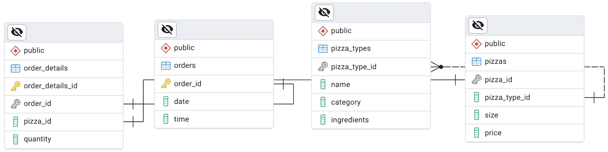  

---

## 🔍 Analysis & Key Questions
The project addresses the following business questions using SQL:

1. Retrieve the total number of orders placed.  
2. Calculate the total revenue generated from pizza sales.  
3. Identify the highest-priced pizza.  
4. Identify the most common pizza size ordered.  
5. List the top 5 most ordered pizza types along with their quantities.  
6. Join the necessary tables to find the total quantity of each pizza category ordered.  
7. Determine the distribution of orders by hour of the day.  
8. Join relevant tables to find the category-wise distribution of pizzas.  
9. Group the orders by date and calculate the average number of pizzas ordered per day.  
10. Determine the top 3 most ordered pizza types based on revenue.  
11. Calculate the percentage contribution of each pizza type to total revenue.  
12. Analyze the cumulative revenue generated over time.  
13. Determine the top 3 most ordered pizza types based on revenue for each pizza category.

---

## 📊 Findings

Below are the key insights from the analysis.  
Each question contains the SQL query and its output (screenshots).  

---

  
<strong>Q1. Retrieve the total number of orders placed</strong>

  **Query:**
  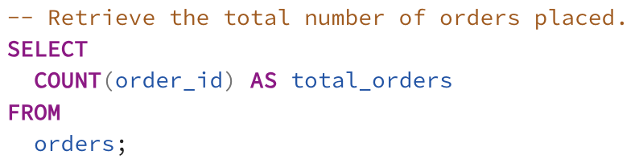

  **Output:**
  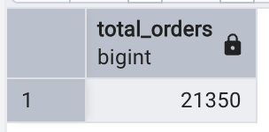

---

  
<strong>Q2. Calculate the total revenue generated from pizza sales</strong>

  **Query:**
  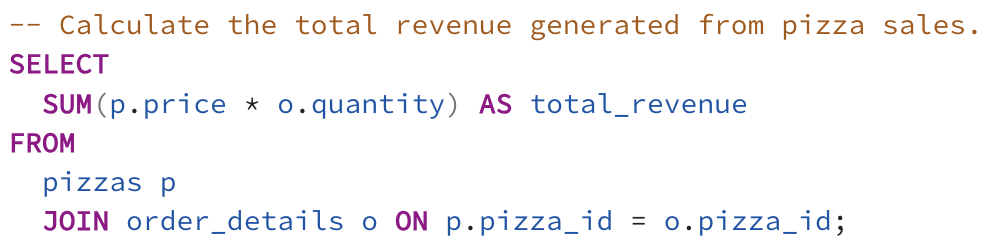

  **Output:**
  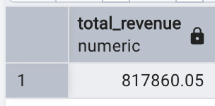

---

  
<strong>Q3. Identify the highest-priced pizza</strong>

  **Query:**
  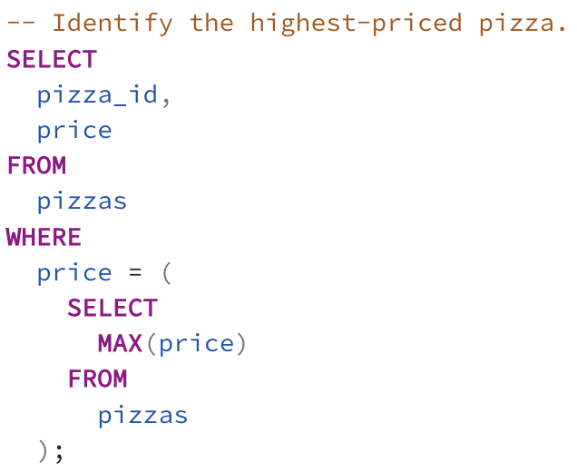

  **Output:**
  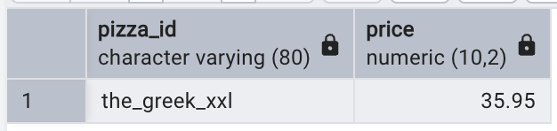

---

  
<strong>Q4. Identify the most common pizza size ordered</strong>

  **Query:**
  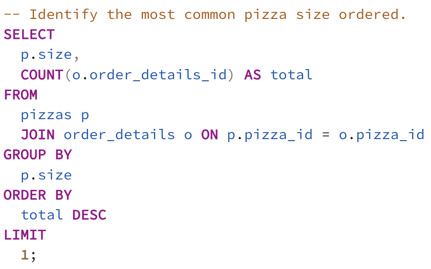

  **Output:**
  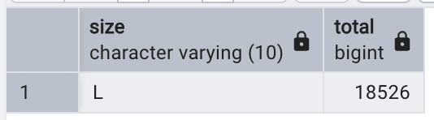

---

  
<strong>Q5. List the top 5 most ordered pizza types along with their quantities</strong>

  **Query:**
  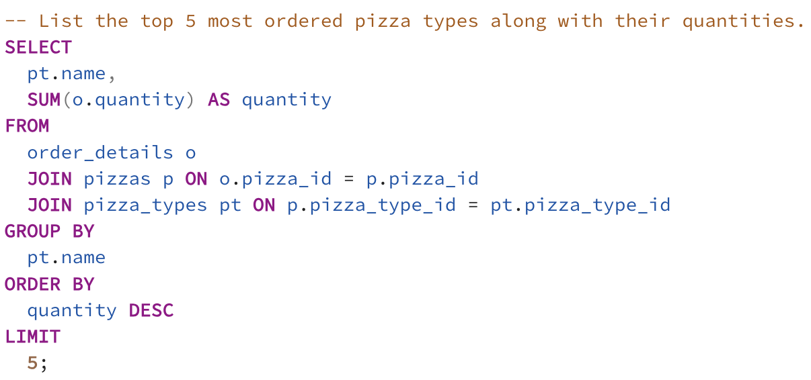

  **Output:**
  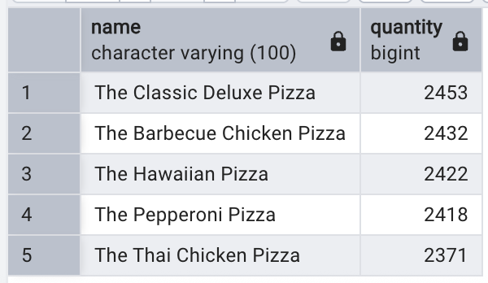

---

  
<strong>Q6. Total quantity of each pizza category ordered (using joins)</strong>

  **Query:**
  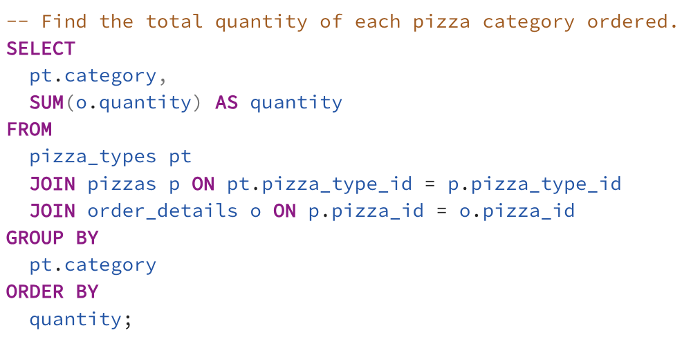

  **Output:**
  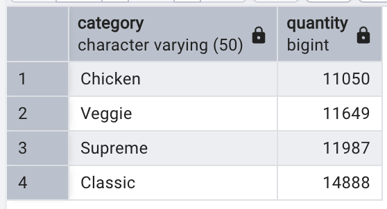

---

  
<strong>Q7. Distribution of orders by hour of the day</strong>

  **Query:**
  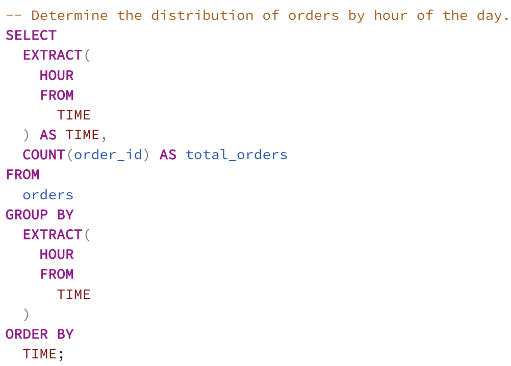

  **Output:**
  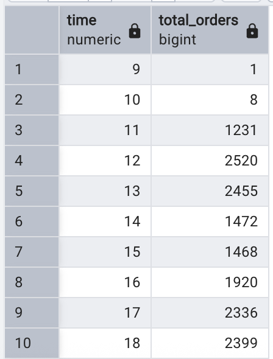

---

  
<strong>Q8. Category-wise distribution of pizzas (using joins)</strong>

  **Query:**
  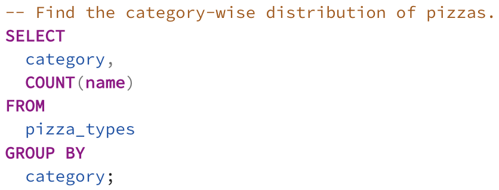

  **Output:**
  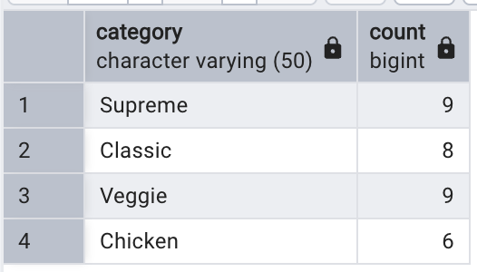

---

  
<strong>Q9. Group orders by date and calculate average pizzas ordered per day</strong>

  **Query:**
  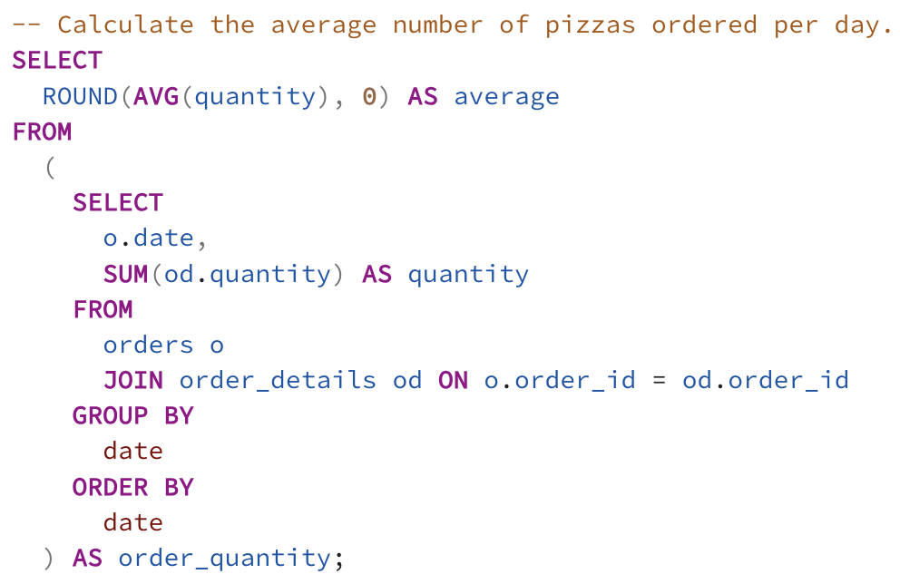

  **Output:**
  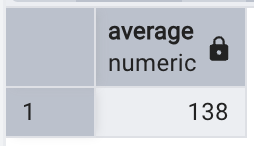

---

  
<strong>Q10. Top 3 most ordered pizza types based on revenue</strong>

  **Query:**
  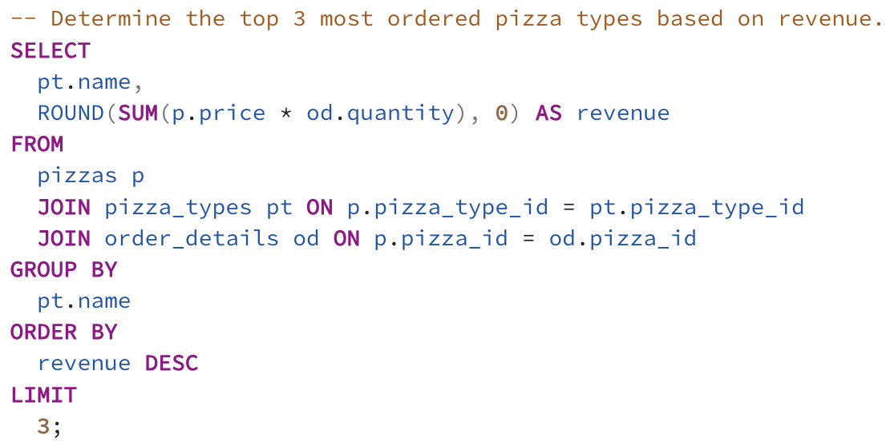

  **Output:**
  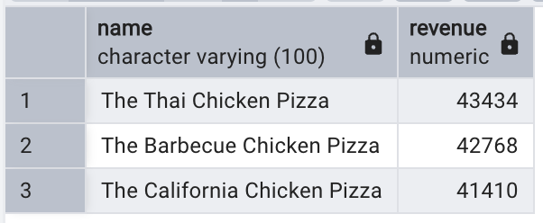

---

  
<strong>Q11. Percentage contribution of each pizza type to total revenue</strong>

  **Query:**
  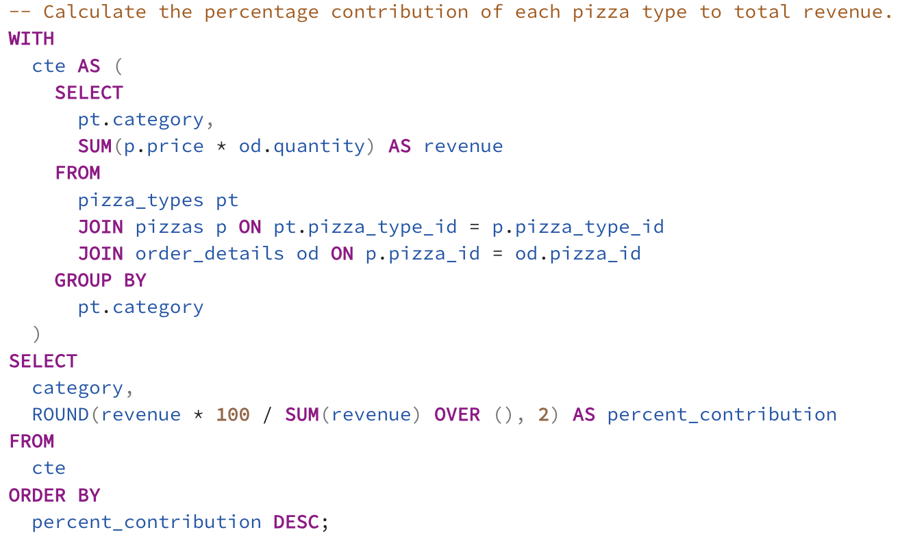

  **Output:**
  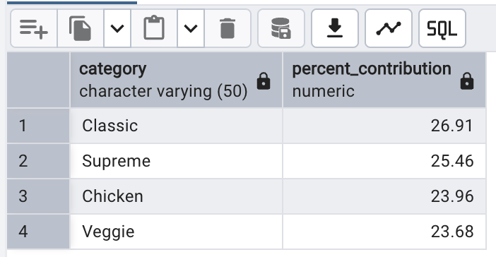

---

  
<strong>Q12. Cumulative revenue generated over time (Window Function)</strong>

  **Query:**
  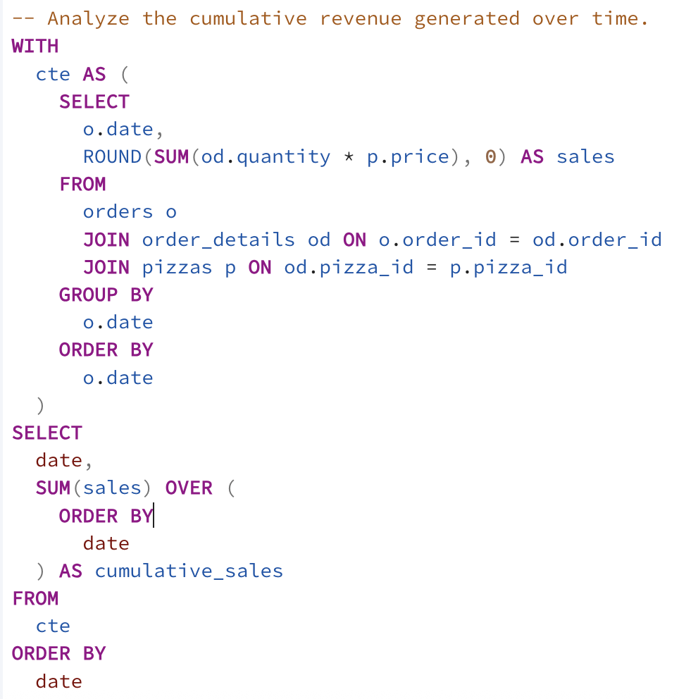

  **Output:**
  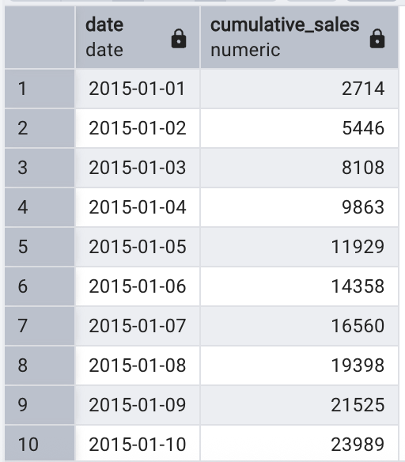

---

  
<strong>Q13. Top 3 most ordered pizza types based on revenue for each category</strong>

  **Query:**
  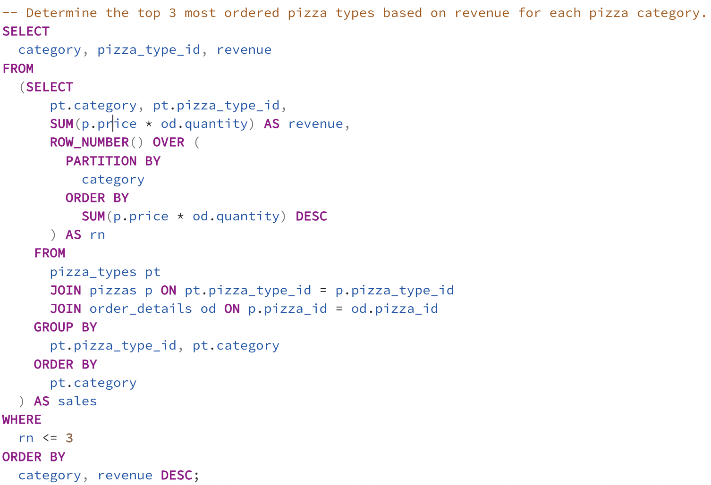

  **Output:**
  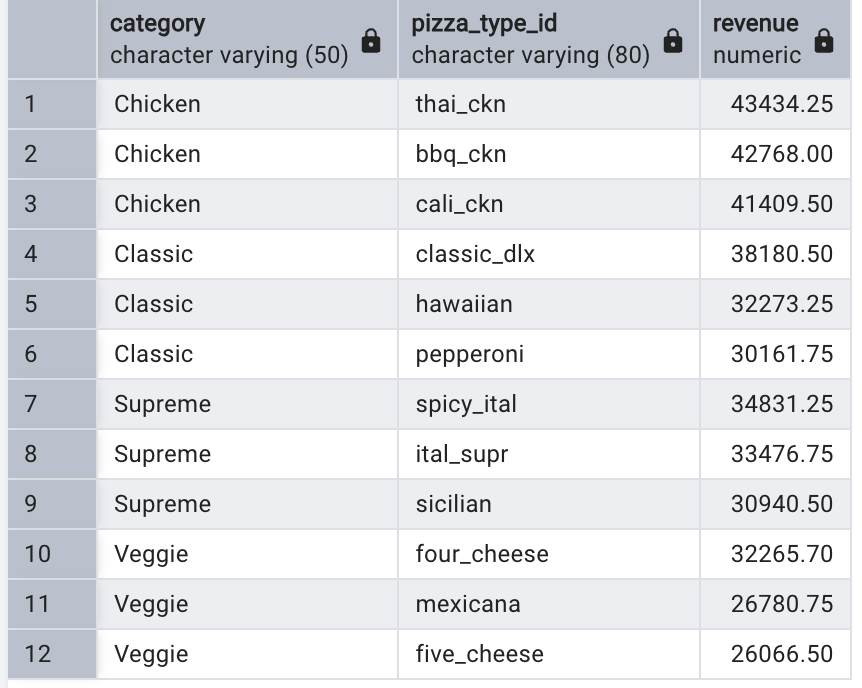

---

🚀 Future Work

Add Power BI dashboards for advanced interactive visualizations

Optimize queries for faster performance

Explore seasonal and customer-level insights

👨‍💻 Author

**Amit Kumar Singh**  
🔗 [LinkedIn Profile](https://www.linkedin.com/in/heyamitsingh)
